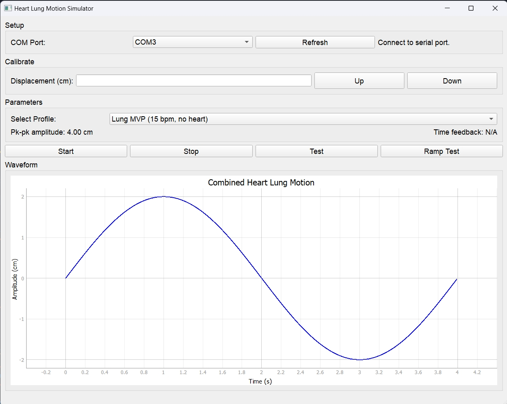

# HeartLungMotionModel

Arduino code works on library "DRV8834.h" and "AccelStepper.h". Need to install libraries AccelStepper and StepperDriver.

arduino_motor: contains the arduino firmware code.

UI: contains two python files - run backend.py to load the UI.

UI usage:

Start - continuous, repetitive movement of the selected profile

Stop - pause all movements

Test - single run of a period of the selected profile

Ramp test - loop through each profile once 

Motor profiles are included in the json file under UI folder
